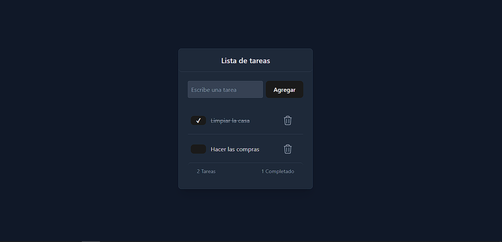

📝 To-Do List
Aplicación de lista de tareas desarrollada con React y Tailwind CSS. Permite a los usuarios agregar, marcar como completadas y eliminar tareas de manera intuitiva con una interfaz minimalista y responsiva.

🚀 Tecnologías utilizadas
⚛️ React.js - Para la estructura y lógica de la aplicación
🎨 Tailwind CSS - Para estilos rápidos y responsivos
🛠️ Vite  - Para un entorno de desarrollo más rápido
💾 LocalStorage - Para persistencia de datos 
📦 Instalación
Clonar el repositorio:
git clone https://github.com/VilPedro/Lista-de-tareas
cd Lista-de-tareas
Instalar dependencias:
npm install
Ejecutar la aplicación en modo desarrollo:
npm run dev
Abrir en el navegador: http://localhost:5173 (o el puerto que indique Vite)
📸 Capturas

🛠️ Funcionalidades
✔️ Agregar nuevas tareas
✔️ Marcar tareas como completadas
✔️ Eliminar tareas
✔️ Persistencia en LocalStorage 
✔️ Diseño responsive con Tailwind
