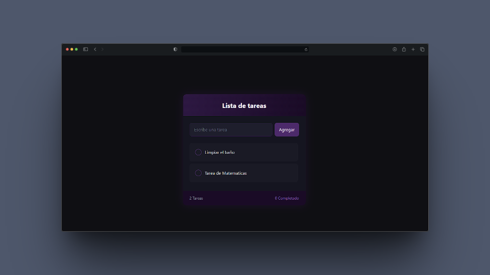

# 📝 To-Do List

**To-Do List** Aplicación de lista de tareas desarrollada con React y Tailwind CSS. Permite a los usuarios agregar, marcar como completadas y eliminar tareas de manera intuitiva con una interfaz minimalista y responsiva.

---

## ✨ Funcionalidades

- ✔️ **Agregar nuevas tareas** 
- ✔️ **Marcar tareas como completadas** 
- ✔️ **Eliminar tareas**
- ✔️ **Persistencia en LocalStorage** 


 
---

## 🖼️ Vista previa



---
## 🧱 Tecnologías usadas

- **React.js**
- **TailwindCSS**
- **Vite**
- **localStorage**

---

## 🚀 Instalación local

1. Cloná el repositorio:

```bash
git clone https://github.com/VilPedro/Lista-de-tareas
cd music-lyrics

